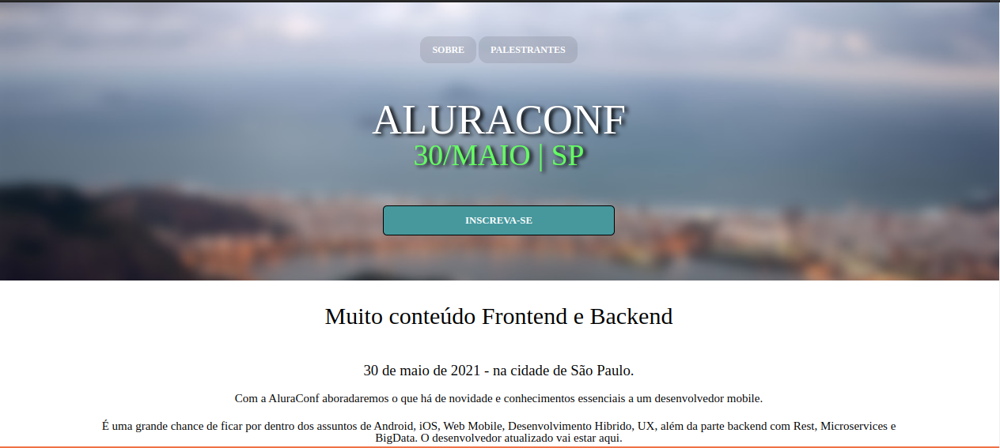
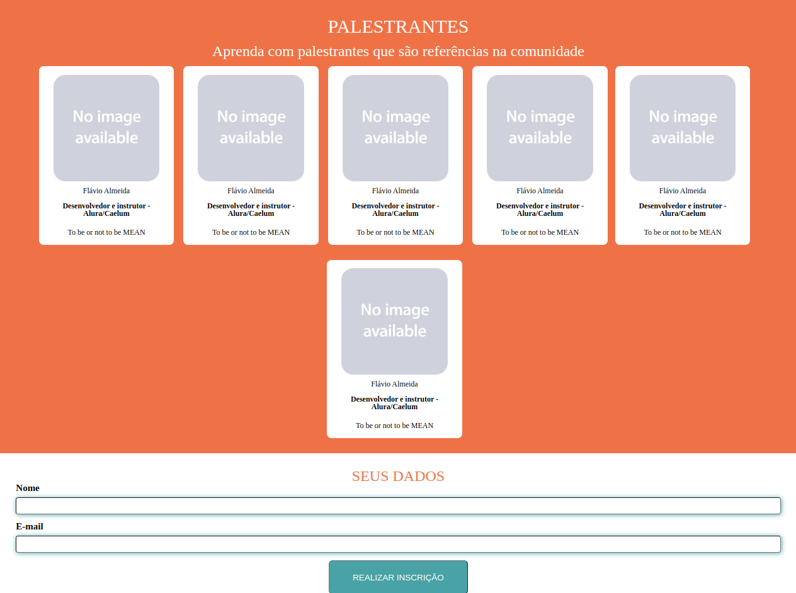

####################################################
## 🌟  Meu primeiro projeto publicado no Github 🚀
####################################################
    

# Página Web: ALURACONF

## Descrição

- Desenvolvi uma landing page para uma conferência da Alura
  no dia 30/05/2021,  um mês antes comecei este desenvolvimento.
   
- Utilizei HTML5, CSS3 e JS como tecnologias deste desenvolvimento
- Conta com animação ao clicar em "Palestrantes"

### Avisos: 
<ui>
    <li>O site não está disponível na internet.</li>
    <li>Feito no curso de desenvolvimento web na Alura.</li>
</ul>

